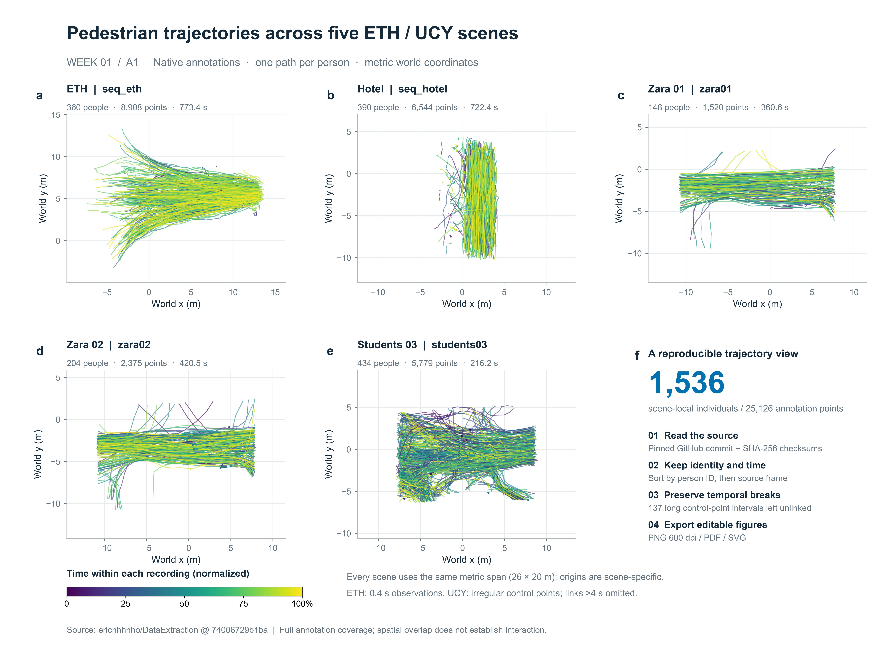

# traj-jiangyujie · 行人轨迹课程

姜昱杰的课程作业，按 `week01`–`week08` 组织。

- [第 2 周：圆环对跖点实验与 ORCA 行为模型](week02/README.md)：真实轨迹、机制、从初始状态出发的仿真、对照与失败分析。
- [第 1 周：ETH/UCY 五场景轨迹图](week01/README.md)。

第二周复现：安装下方依赖后运行 `python -X utf8 -m week02.model.run`，输入数据已包含在课程包中。



**本周交付：** [五张场景图与总览图](week01/figures) · [一段结论](week01/conclusion.md) · [场景统计](week01/results/scene_summary.csv) · [代码](week01)

## 运行

已验证 Python 3.12。在仓库根目录安装依赖并运行：

```bash
python -m pip install -r requirements.txt
python -X utf8 run.py --download
```

首次下载约 3.1 MB（五场景坐标和核验资料，共 25 个文件），存入 `data/raw/`；再次运行只核验已有文件。下载完成后可用 `python -X utf8 run.py` 离线重画。

仓库保留六张 PNG；运行时同时生成本地 PDF/SVG，便于编辑和打印。原始数据、缓存和重复导出格式不加入 Git。测试命令：`python -m pip install pytest==9.1.1`，然后 `python -m pytest -q`。

## 文件

- `run.py`：唯一运行入口，下载、核验、绘图、导出统计。
- `week01/`：四个模块（数据、轨迹、绘图、样式）、图件、结论和场景统计。
- `week02/`–`week08/`：保留后续周次的作业目录。
- `configs/week01.json`：场景、帧率、断线阈值和分辨率。
- `data/manifest.json`：固定下载地址、文件大小和 SHA-256。
- `tests/`：坐标顺序、个体隔离、时间断线及校验测试；GitHub 自动运行。

## 数据与读图

数据来自 [erichhhhho/DataExtraction](https://github.com/erichhhhho/DataExtraction/tree/74006729b1bafafa4f9530150af3ba282b1b0ef3)，固定提交 `74006729b1bafafa4f9530150af3ba282b1b0ef3`。五场景为 `seq_eth`、`seq_hotel`、`zara01`、`zara02`、`students03`（源目录 `univ`，原名 `students003`）。

原 CSV 的四行依次是 frame、ID、y、x，读取后明确转换为米制 x、y，按场景内个体 ID 分组并按帧排序。ETH 保留 0.4 s 原生采样（两场景帧率基准分别为 15、25 fps）；UCY 使用 25 fps 的不等间隔控制点，超过 4 s 的间隔断开。4 s 是显示参数，连线属于几何插值，不增加观测点。源文件校验和 ETH obsmat / UCY pixel + H 坐标一致性核验在每次运行时执行；后者不是独立定位精度验证。

颜色表示时间，不代表身份或速度。总览按各场景记录时段归一化时间，各图均为 26 × 20 m 等比例显示、保留各自原点；时间零点为该场景首个标注帧。单场景右图选择整秒网格上可见个体最多的 12 s 窗口，并列取最早，灰线为全时段背景。空间路径交叉不能单独证明碰撞或避让；本周只完成 A1。

代码沿用既有工作台 `visualization.py` 的按 ID 绘轨迹逻辑、论文 `重绘_fig8_轨迹总览.py` 的连续段处理，以及 `pemflow_style.py` 的字体、分面和导出样式，独立适配 ETH/UCY。来源与授权范围见 [NOTICE](NOTICE.md)。
