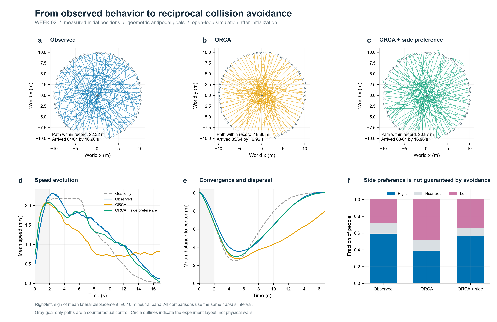
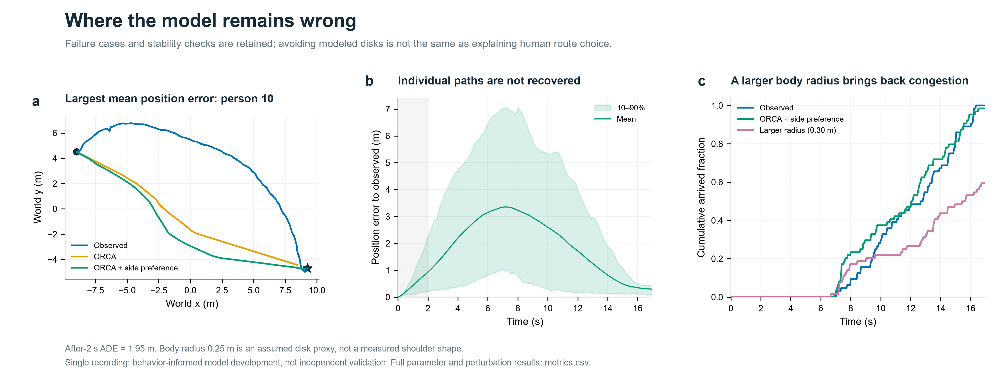

# Week 02 · 圆环对跖点实验：从行为判断到 ORCA 仿真

本周依照课堂要求完成“行为判断 → 模型主张 → 从初始状态仿真 → 对照与失败分析”。代表模型为 **带个体侧偏偏好的 ORCA**，保留直接走向目标、普通 ORCA、统一右偏等对照。它部分复现了群体减速和绕行，尚不能准确预测每个人的路径，也不能保证拥挤状态下严格无碰撞。



[真实轨迹及速度](results/observed_trajectories.png) · [一次局部冲突与避让证据](results/interaction_detail.png) · [同步动画](results/comparison.gif) · [失败案例](results/failure_cases.png) · [全部指标](results/metrics.csv)

## 1. 数据、初始状态与可检验的行为判断

使用用户提供的 `circle-10m-64-1.txt`，64 人、425 个共同帧、27,200 行，帧号 37–461，无重复个体帧或缺帧。五列按 `ID / frame / x / y / height` 解释；第五列为 160、170、180，仅保留原始值，不进入动力学。

**实验设置依据 Yao Xiao 等人的 2018 年文章**：采用半径 10 m、64 人的圆环条件，参与者从圆周上的起点收到统一口令后向各自对跖目标尽快移动，摄影帧率为 25 fps。这里将这些文献实验设置与下面的模型假设分开列示。

原文件无表头；坐标按厘米转换为米，并以约 1,007 源坐标单位的初始半径与名义 10 m 半径交叉核对。按文献 25 fps 重建的记录长 16.96 s；拟合初始圆心为 `(0.13294, -0.09215) m`，半径为 `10.06977 m`。时间零点是所提供的第 37 帧，不保证等于起步口令时刻。依据与参数在 [config.json](model/config.json)，原文件哈希在 [experiment.json](results/experiment.json)。

- **判断 H1：接近交汇区域时，多数行人降低速度。** 每个人的接近阶段取 1.6–2.6 s，交汇阶段取其最接近拟合圆心时刻前后各 0.4 s。49/64 人的后者速度较低，群体均值从 2.255 降到 1.815 m/s，下降约 19.5%。这是轨迹中的相关证据，不能单凭它确认个体的避让意图。
- **判断 H2：路径会偏离直径，并同时存在左右绕行及总体右偏。** 最大横向偏移中位数为 2.149 m；以沿个人起终点方向的右侧为正，平均横向位移大于 0 的有 42/64 人。为避免微小摆动被当作侧偏，采用 ±0.10 m 中性区后，右/左/近直径为 38/18/8 人。模型应产生双侧路线，不能只复现全体同向旋转。

速度采用中心前后各 5 帧的位移差（总窗 0.4 s），端点缩短窗口；路径长按 0.2 s 间隔累计以减少逐帧抖动影响。图中的局部例子将当时速度保持不变，预测 TTC 与后来实际距离对照，并展示转向和减速。它是按公开规则事后挑选的说明性例子，详见 [interaction.json](results/interaction.json)，不等于人工标注的行为真值。

## 2. 模型主张与机理

**主张：行人先根据预期冲突调整期望行走方向，再在互惠避碰约束内选择速度；个体保留不同的绕行侧偏好。** H1 支持引入局部交互约束，H2 支持允许左右两侧选择。下列规则是本课程可检验的模型假设。

### 速度障碍物与 ORCA

对于行人 i、j，令相对位置 `p_ij = p_j - p_i`，相对速度 `w = v_i - v_j`，身体圆盘半径之和为 `R = 2r`。速度障碍物是：

$$VO_{ij}^{\tau}=\{w\mid\exists s\in(0,\tau],\;\|p_{ij}-sw\|<2r\}.$$

落在这个集合内的相对速度，意味着保持当前速度将于预见时间内相撞。ORCA 根据当前相对速度与这个集合边界构造修正量 `u_ij` 和外法向 `n_ij`，双方各承担一半修正：

$$\left[v-\left(v_i+\tfrac12u_{ij}\right)\right]\cdot n_{ij}\geq0.$$

每名行人同时考虑其余 63 人，在所有允许半平面与最大速度圆盘的交集中，选择最接近期望速度的解：

$$v_i^{new}=\arg\min_v\|v-v_i^{pref}\|^2,\qquad\|v\|\leq v_i^{max}.$$

所有人同步更新，`p_i(t+Δt)=p_i(t)+Δt·v_i_new`。这里没有事后速度平滑、位置投影或真实轨迹回填。约束无公共可行解时使用 RVO2 的最小违约回退，并记录违约及圆盘重叠；此时不再声称严格避碰。

### 本课程加入的侧偏规则

每人从固定随机种子 42 抽取一个持续不变的左右偏好，右偏概率设为 0.65，参考本记录 42/64 的方向比例；**没有按每个人的真实后续路线分配方向**。各人只使用当前位置、速度、个人目标及邻人的当前位置和速度，不读取邻人目标或未来轨迹。

用直达目标的期望速度与邻人当前速度预测最近接近时间 `t_ca` 和距离 `d_ca`。对前方且 `0<t_ca<4 s` 的邻人，风险权重为 `exp[-(d_ca/1 m)^2] × (1-t_ca/4 s)`；其他情况为 0。取最大权重，将期望方向向个人偏好侧旋转 `β × 权重`，再交给 ORCA。默认 `β=0.30 rad`（上限约 17.2°），风险低时恢复朝向目标。

在同一记录内比较 β=0.30、0.50、0.70，保留 0.30 作为展示参数，以同时保留减速与双侧绕行。0.70 的速度曲线误差更小，但只有 35.9% 的模拟个体在最近圆心处减速，弱于实测 76.6%；因此没有只按一个误差指标挑最好看的结果。所有试验均保留在指标表中。**这是同记录的模型构建与参数探索，不是独立样本验证。**

### 初始化和参数

初始位置严格采用第 37 帧；初始速度由前 0.2 s 位移估计。每人的期望速度取 1–2 s 内、两端均处于该区间的 0.2 s 速度的 75% 分位数，并限制为 1.0–3.2 m/s。起步期望速度以 0.5 s 时间尺度从初始速度幅值过渡；最大速度为个人期望速度的 1.2 倍（且不低于初始速度）。

目标由 `g_i = 2c - p_i(0)` 确定，未用真实末帧位置；进入目标 0.5 m 范围记为到达，接近目标时按剩余距离/0.4 s 限制期望速度，避免越过目标。身体半径假设为 0.25 m，ORCA 预见时间为 2 s，侧偏判断的预见时间为 4 s，积分步长为 0.04 s。圆周是起终点布局，未设置成墙体。

数值仿真从 t=0 起独立推进，使用前 2 s 做初始化和速度参数估计，2 s 以后不输入真实位置或速度。侧偏概率和展示参数依据同一记录确定，因此“2 s 后误差”仍是同记录回放误差，不能当作独立预测精度。[initial_conditions.csv](results/initial_conditions.csv) 保留每个人的初值、目标、期望速度和抽到的侧偏。

## 3. 证据支持到什么程度，何时失效

| 指标 | 实测 | 普通 ORCA | ORCA + 个体侧偏 |
|---|---:|---:|---:|
| 16.96 s 内到达人数 | 64 | 35 | 63 |
| 平均速度曲线 RMSE（m/s） | — | 0.457 | 0.163 |
| 平均圆心距离曲线 RMSE（m） | — | 1.983 | 0.326 |
| 最近圆心阶段平均速度（m/s） | 1.815 | 1.249 | 1.796 |
| 右绕比例（±0.10 m 中性区） | 59.4% | 39.1% | 56.3% |
| 平均圆心距离的最小值（m） | 3.538 | 2.724 | 2.969 |
| 2 s 后平均位置误差 ADE（m） | — | 3.342 | 1.951 |

路径长度统计使用共同的 16.96 s 记录窗口；未完成者只计已走路径，较短不代表表现更好。到达时间的中位数只在已到达者中计算，不能忽略未到达者而宣称模型更快。



- **个体路线仍不准确。** 代表模型 ADE 为 1.951 m，最大横向偏移中位数只有 1.515 m，低于真实 2.149 m；群体曲线接近不意味着逐人路线正确。失败图展示误差最大的个体。
- **拥挤下不保证无碰撞。** 默认代表模型出现 3,524 次“个体×时间步”的线性规划回退，最小模型圆心距离为 0.48296 m，小于假设的 0.50 m 身体直径，最大圆盘侵入约 17.0 mm。记录了 289 个“行人对×积分间隔”的重叠，不能把它称为 289 次独立碰撞事件。真实轨迹也有非常近的投影点，不能把假设圆盘重叠直接解释为现实中撞人。
- **对体型和预见时间敏感。** 身体半径 0.30 m 时只到达 38 人；预见时间 1/3 s 时分别到达 59/57 人。代表参数的良好表现不能推广为所有参数都稳定。
- **随机性和时间步长存在影响。** 侧偏种子 42/43/44 下到达 63/61/62 人，右绕比例 56.3%/76.6%/54.7%；个人期望速度独立扰动 ±10% 的两次试验到达 62/60 人。步长减半到 0.02 s 后最大圆盘侵入降至约 3.9 mm，但到达人数为 60，仍不能宣称数值结果完全收敛。
- **没有加速度上限和真实身体形状。** 默认代表模型的最大速度指令变化折算约 36.8 m/s²，暴露了理想速度代理与人体运动的差距。数据只有一条记录，尚缺独立重复实验及人工行为标注。

## 4. 一段结论

本周以 64 人圆环对跖点轨迹为基础，识别了交汇减速与具有总体右偏的双侧绕行，并用相同真实初始位置检验速度障碍物模型。普通 ORCA 可产生局部避碰调整，但在该实验中容易形成中心滞留；加入基于预测风险的持续个体侧偏后，记录期内到达人数从 35 提高到 63，平均速度曲线 RMSE 从 0.457 降到 0.163 m/s，最近圆心阶段平均速度为 1.796 m/s，接近实测 1.815 m/s。这支持“局部互惠避碰需要配合路线方向选择”的模型主张。不过，个体路径、极端绕行、严格非重叠与参数稳健性仍有明显不足，结论限于该次实验的机制复现。

## 5. 使用的资料、开源代码与大模型

- 轨迹由用户提供；实验设置依据 [Yao Xiao 等（2018）：Investigation of Pedestrian Dynamics in Circle Antipode Experiments](https://arxiv.org/html/1808.01443v1)，特别是第 2 节的圈半径、人数、对跖目标、统一起步要求及 25 fps 摄影设置。
- 原始 VO：[Fiorini & Shiller, 1998](https://doi.org/10.1177/027836499801700706)。Ming C. Lin、Dinesh Manocha、Jur van den Berg 等参与发展的 RVO/ORCA 是互惠扩展，不应将原始 VO 的提出者混淆。
- ORCA：[官方项目及论文](https://gamma.cs.unc.edu/ORCA/)，van den Berg、Guy、Lin、Manocha 的互惠避碰方法。
- 代码：[RVO2 Agent.cc 固定提交](https://github.com/snape/RVO2/blob/1c25b27258d191e26c2df83ff6e31abc8efbdaed/src/Agent.cc)，Apache-2.0，[许可证](model/RVO2-LICENSE.txt)。移植了行人 ORCA 约束与 LP1/LP2/LP3；改为 NumPy 全邻居计算，省略静态障碍/KD 树，增加可行性与积分间隔距离诊断。个体侧偏、初始化、评价与图件为课程扩展。
- 复用上周 `week01/style.py` 的论文样式、分面、PNG/PDF/SVG 导出与按人绘制轨迹的结构。
- 使用 Codex（GPT-6）辅助查阅资料、改编和编写代码、组织图件与文字；报告中的统计、仿真轨迹和图件由本地提交脚本实际运行生成。

## 6. 复现与文件

在仓库根目录、Python 3.12 环境运行：

```bash
python -m pip install -r requirements.txt
python -X utf8 -m week02.model.run
```

输入已包含，不需要网络下载，也不需要安装 RVO2 C++。默认重跑 15 个模拟条件并生成图和动画；`--no-gif` 跳过动画，`--figures-only` 从已保存的代表仿真重画。测试：`python -m pip install pytest==9.1.1` 后运行 `python -m pytest -q`。

```text
week02/
├── README.md
├── model/       # 输入 TXT、配置、ORCA、仿真、评价、交互例子、绘图、运行入口、许可证
└── results/     # 4 张 PNG、1 个 GIF、指标 CSV、代表轨迹 NPZ、初值及数据/交互说明
```

[metrics.csv](results/metrics.csv) 保留实测及全部 15 个模拟条件；[time_series.csv](results/time_series.csv) 和 [individual_metrics.csv](results/individual_metrics.csv) 保留代表模型和大半径失败案例的逐时/逐人证据。`simulation.npz` 存储公共时间、ID，以及直接走向目标、普通 ORCA、个体侧偏和大半径失败情形的坐标；全部其他条件可由脚本重跑。高分辨率 PNG 和动画随 Git 提交，PDF/SVG 仅在本地生成，避免重复文件占用仓库。
