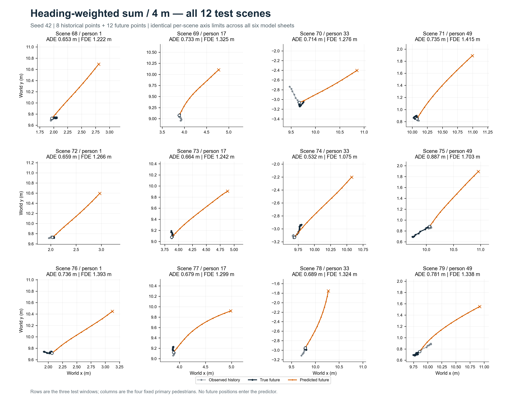

# Week 03 · Social LSTM 邻居信息对照

教师 TrajNet++ 课堂代码；圆环对跖点实验；8 点历史预测 12 点未来。

## ADE / FDE

ADE 为全部预测点的平均位置误差，FDE 为最后一点的位置误差，**越小越好**。下表为三个种子的均值 ± 样本标准差；匀速外推无训练种子。

| 模型 | 测试 ADE（m）↓ | 测试 FDE（m）↓ |
| :--- | ---: | ---: |
| 原始 Social · 4 m | 0.614 ± 0.058 | 1.205 ± 0.150 |
| 屏蔽邻居 | 0.554 ± 0.046 | 1.119 ± 0.073 |
| 缩小邻域 · 2 m | 0.692 ± 0.053 | 1.322 ± 0.082 |
| 扩大邻域 · 8 m | 0.675 ± 0.102 | 1.299 ± 0.168 |
| 等权求和 · 4 m | 0.714 ± 0.031 | 1.375 ± 0.068 |
| 方向加权求和 · 4 m | 0.702 ± 0.048 | 1.310 ± 0.071 |
| 匀速外推（参考） | 0.125 | 0.234 |

[验证集与测试集完整指标](results/tables/extended_summary.csv) · [逐种子、逐场景记录](results/runs)

## 结论

屏蔽邻居取得六种 LSTM 中最低的平均误差。方向加权相较等权求和，ADE 降低约 1.7%、FDE 降低约 4.7%，但仍未超过原始模型；所有 LSTM 均弱于匀速外推。模型对测试后段的减速、停步预测不足，增加邻居信息没有带来稳定收益。

本次仅含单次实验、三个测试时间窗口，每组训练 10 轮。等权求和与方向加权是在查看首批结果后提出的探索，复用同一测试集，结论限于当前课堂设置。

## 预测与实际轨迹

[查看六种模型的全部 12 个测试场景](results/gallery/README.md) · [全部 64 人对照](results/gallery/all_64_agents.png)

下图为方向加权模型，固定种子 42：灰色为历史，深色为实际未来，橙色为预测未来；每幅图标注 ADE/FDE。六模型图集中，同一场景采用一致的坐标范围。

## 修改与实验条件

在教师 4×4 网格池化基础上，分别屏蔽邻居、调整邻域至 2 m / 8 m、改为同格求和，以及加入方向权重。方向规则为 `w = 0.25 + 0.75 × max(0, cos θ)`：前方权重更高，低于 0.1 m/s 时恢复等权。[模型代码](model/experiment.py)

训练 / 验证 / 测试为 56 / 12 / 12 个场景；种子 42、43、44，各 10 轮，相同初始化与样本顺序。仅按验证 ADE 选轮，预测只使用历史信息；联合预测 64 人，指标只评价固定的四个主要行人。12 步预测时长为 0.96 s。

## 复现与来源

[安装、训练、绘图与检查](docs/PROTOCOL.md) · [教师代码、许可证与 AI 辅助说明](model/SOURCE.md)

`model/` 保存代码与固定数据，`results/gallery/` 保存完整轨迹图，`results/tables/` 保存指标，`results/runs/` 保存 18 份权重、预测与训练记录。使用 Codex（GPT-6）辅助实现、运行和整理，表中数值均来自实际实验。
