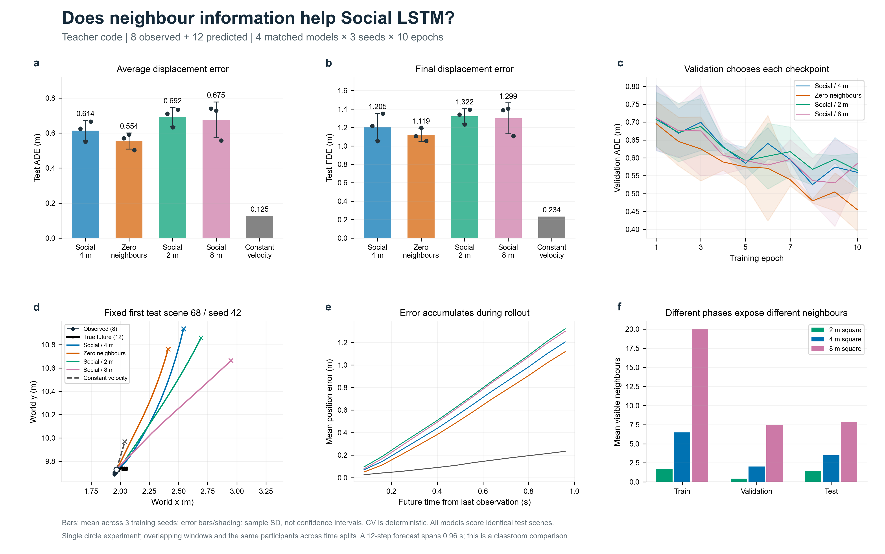

# Week 03 · Social LSTM 中的邻居信息有用吗？

**行人轨迹预测 · 圆环对跖点实验 · 教师 TrajNet++ 课堂代码**

`6 种模型` · `3 个随机种子` · `每组 10 轮` · `8 点历史 → 12 点未来`

[结果与结论](#结果与结论) · [完整轨迹图集](results/gallery/README.md) · [模型与改动](#模型与改动) · [运行与复现](docs/PROTOCOL.md) · [代码来源](model/SOURCE.md)

> **主要发现：** 屏蔽邻居在本次对照中取得最低的 LSTM 平均误差。方向加权相较等权求和有所改善，但六种 LSTM 都未超过匀速外推；结果不支持“增加邻居信息必然提高预测精度”。

## 先看轨迹

**灰色是已观测历史，深色是实际未来，橙色是预测未来。** 下图展示方向加权模型的全部 12 个测试场景；每幅图标出 ADE/FDE。行对应三个时间窗口，列对应四个固定主要行人。


[六种模型逐一查看 →](results/gallery/README.md) · [全部 64 人的全场对照 →](results/gallery/all_64_agents.png)

图集统一使用种子 42，同一场景在六个模型下的坐标范围相同。64 人图展示联合预测过程；正式指标只评价预先固定的四个主要行人。

## 结果与结论

三个随机种子的均值 ± 样本标准差，单位 **m，越低越好**。匀速外推不训练，故不报告种子标准差。

| 模型 | 验证 ADE | 测试 ADE | 测试 FDE |
| :--- | ---: | ---: | ---: |
| 原始 Social · 4 m | 0.494 ± 0.023 | 0.614 ± 0.058 | 1.205 ± 0.150 |
| **屏蔽邻居** | **0.441 ± 0.036** | **0.554 ± 0.046** | **1.119 ± 0.073** |
| 缩小邻域 · 2 m | 0.531 ± 0.019 | 0.692 ± 0.053 | 1.322 ± 0.082 |
| 扩大邻域 · 8 m | 0.484 ± 0.082 | 0.675 ± 0.102 | 1.299 ± 0.168 |
| 等权求和 · 4 m | 0.513 ± 0.017 | 0.714 ± 0.031 | 1.375 ± 0.068 |
| 方向加权求和 · 4 m | 0.539 ± 0.027 | 0.702 ± 0.048 | 1.310 ± 0.071 |
| 匀速外推（参考） | 0.237 | 0.125 | 0.234 |

[完整精度表](results/tables/extended_summary.csv) · [逐场景误差变化](results/figures/paired_scene_errors.png) · [逐种子方向加权效果](results/audit/direction_effects.json)

- **屏蔽邻居：** 相比原始模型，平均测试 ADE 降低约 **9.7%**；ADE/FDE 均为 2/3 个种子改善。
- **改变邻域：** 缩小或扩大后，平均测试误差均上升；改变网格范围并未带来稳定收益。
- **加入方向：** 相比等权求和，ADE 降低约 **1.7%**、FDE 降低约 **4.7%**，分别有 2/3、3/3 个种子改善，但仍弱于原始模型。

**结论。** 在相同划分、8+12 预测窗口和训练预算下，邻居信息的使用方式比简单增加邻居更值得关注。固定方向权重带来了有限改善，尚未解决减速和停步的预测偏差：训练、验证、测试窗口的主要行人平均逐步速度约为 1.84、1.15、0.24 m/s，学习模型常继续预测前进。当前证据来自单次实验、三个测试时间窗口及 10 轮训练；等权求和与方向加权还是查看首批结果后的探索，不能作为独立验证，也不能推广为社会交互信息普遍无用。

<details>
<summary><strong>展开第一阶段总览与局部案例</strong></summary>

以下总览只包含原始、屏蔽邻居、2 m、8 m 四组；六模型最终数值以上表为准。



[同场景四目标对照](results/figures/trajectory_comparison.png) · [求和池化局部案例](results/figures/sum_pool_cases.png) · [网格示意](results/figures/neighbour_information.png)

</details>

## 模型与改动

教师实现把邻居相对位置映射到自身中心的 **4×4 网格**，将邻居 32 维隐藏状态压缩成 8 维，再把网格嵌入成 32 维，与自身速度嵌入拼接，更新 LSTM 并递推未来位置。目标位置分支关闭。

| 对照 | 修改内容 | 用途 |
| :--- | :--- | :--- |
| 原始 Social | 4 m 网格，同格邻居索引赋值 | 教师实现基线 |
| 屏蔽邻居 | 嵌入前将网格置零，保留网络偏置 | 判断邻居输入是否有贡献 |
| 2 m / 8 m | 固定 4×4 格数，改变单格边长 | 比较邻域范围与空间分辨率 |
| 等权求和 | `scatter_add` 累加同格隐藏状态 | 避免同格邻居被覆盖 |
| 方向加权求和 | 按运动朝向加权，再累加同格状态 | 强调前方邻居 |

方向权重为 `w = 0.25 + 0.75 × max(0, cos θ)`，θ 是自身朝向与邻居相对位置的夹角。正前方权重为 1，侧后方为 0.25；低于 0.1 m/s 时恢复等权。朝向只由当前与上一点计算，预测阶段使用已预测的位置；没有引入真实未来或额外网络参数。

六种配置均为 **25,633 个参数**。屏蔽邻居时部分参数不再收到数据梯度；范围对照同时改变了单格分辨率；教师基线的同格覆盖也不同于标准求和池化。详见 [模型实现](model/experiment.py) 和 [来源说明](model/SOURCE.md)。

## 实验条件

- **固定数据：** 教师包 56/12/12 个训练、验证、测试场景，先按时间划分再截窗，不共享帧。
- **预测任务：** 8 点历史、12 点未来；间隔 0.08 s，历史首尾跨度 0.56 s、预测时长 0.96 s。
- **一致训练：** 种子 42/43/44，各 10 轮，相同初始化与样本顺序；仅按验证 ADE 选取权重。
- **历史输入：** 验证和测试只输入 8 点历史，联合递推 64 人；ADE/FDE 只评价 ID 1、17、33、49。

测试集只有三个时间窗口，同一集合内窗口重叠，12 个场景不是 12 次独立实验。[完整协议与限制 →](docs/PROTOCOL.md)

## 复现与文件导航

安装 [固定依赖](requirements.txt) 后，在仓库根目录运行下列命令可复核原始四组的已训练权重：

```bash
python -X utf8 -m week03.model.run --evaluate-only
```

**全部六模型复核、从头训练和绘图命令：** [实验协议与复现](docs/PROTOCOL.md)。18 份权重、预测数组和训练记录已随仓库提交。

```text
week03/
├── README.md                 # 报告、图与结论
├── requirements.txt          # 固定运行依赖
├── docs/PROTOCOL.md           # 数据协议、复现命令、检查
├── model/                    # 模型、配置、教师源码与数据
└── results/
    ├── gallery/              # 六模型完整轨迹图 + 全部 64 人
    ├── figures/              # 总览、网格、热图与案例
    ├── tables/               # 统一指标与数据统计
    ├── runs/                 # 三组实验的权重、预测与逐轮记录
    └── audit/                # 图件选择规则与配对效果记录
```

[实验文件索引](results/README.md) · [源码与许可证](model/SOURCE.md) · [自动检查](../.github/workflows/week03.yml)

**AI 辅助说明：** 使用 Codex（GPT-6）辅助阅读源码、实现、运行、检查、绘图和整理文字；所有报告数值均来自实际训练与预测。
