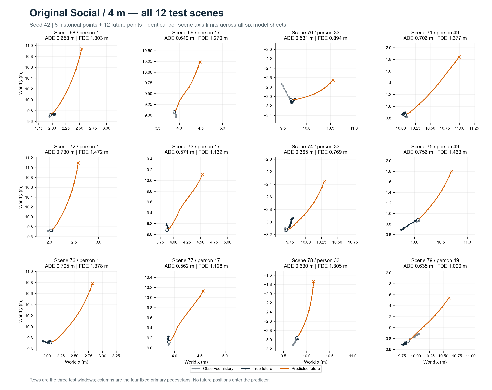
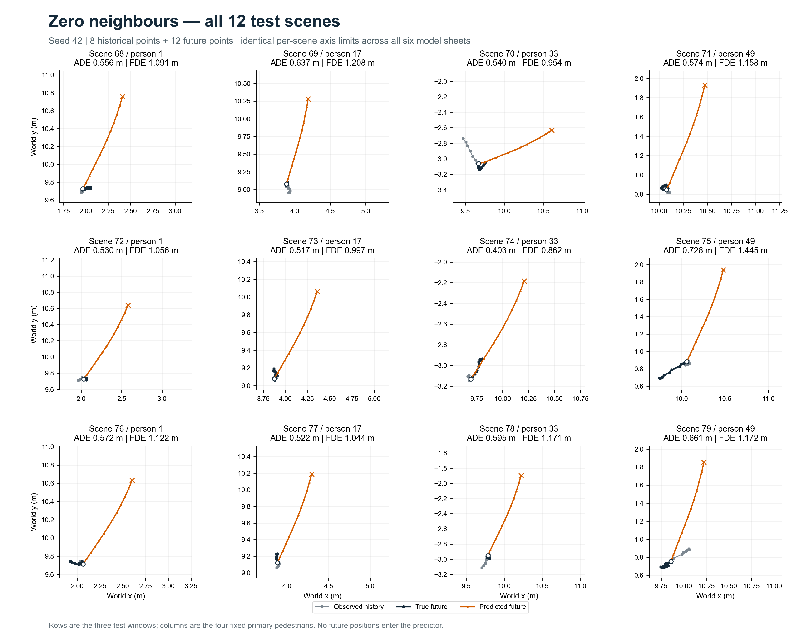
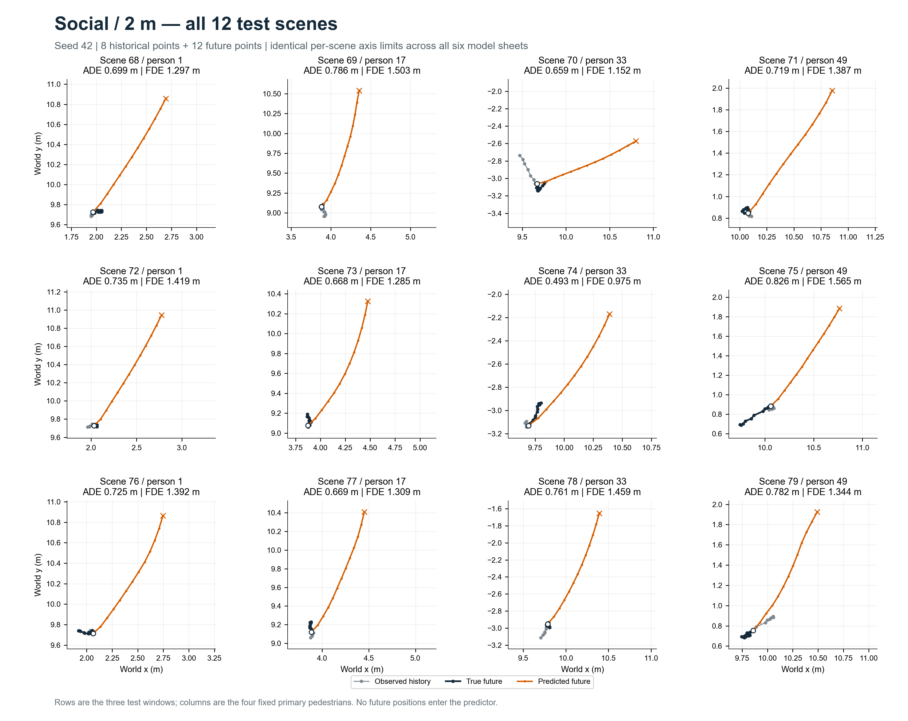
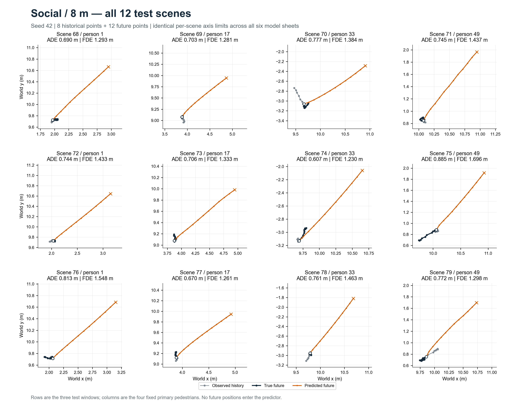
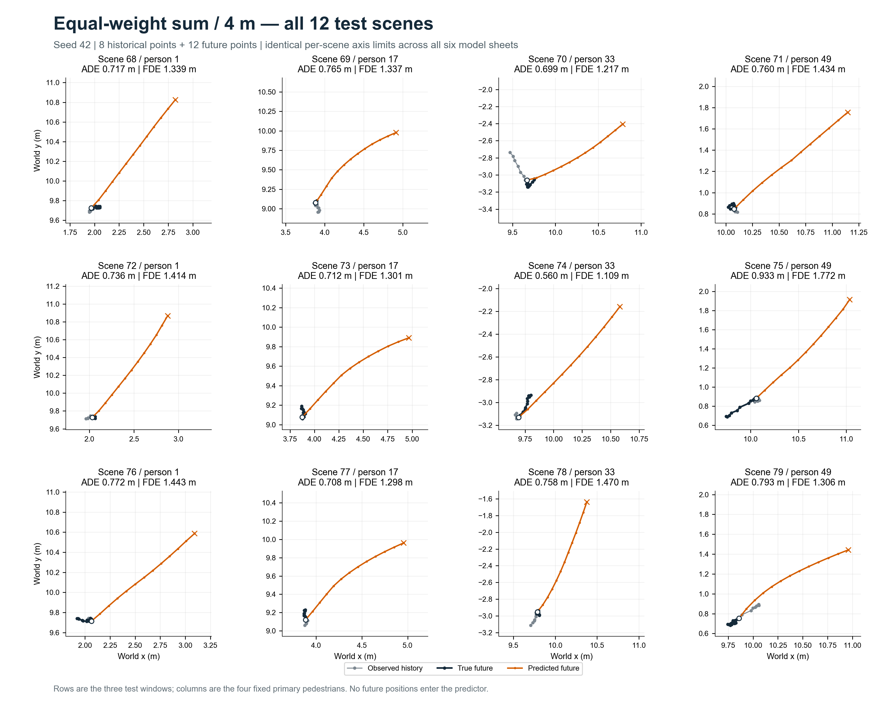
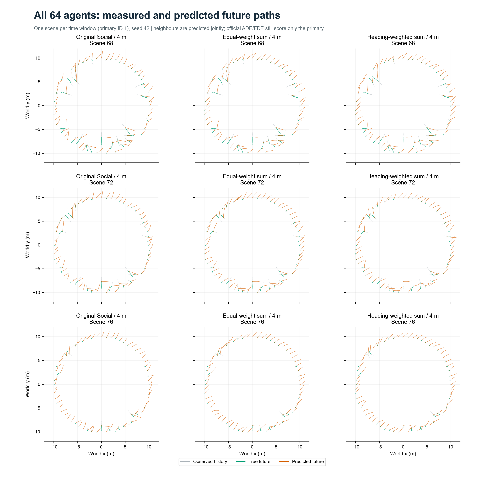

# Week 03 · 完整轨迹图集

[返回课程报告](../../README.md) · [结果索引](../README.md) · [全部 64 人](#全部-64-人)

六种模型均展示**种子 42、全部 12 个测试场景**；行对应三个时间窗口，列对应 ID 1、17、33、49。同一场景在六张图中坐标范围一致。

**图例：** 灰色为 8 点历史，深色为 12 点实际未来，橙色为 12 点预测未来，叉号为预测终点。点击图片可查看原尺寸。

<strong>方向加权求和 · 4 m</strong> · 展开全部场景

<strong>原始 Social · 4 m</strong> · 展开全部场景

<strong>屏蔽邻居</strong> · 展开全部场景

<strong>缩小邻域 · 2 m</strong> · 展开全部场景

<strong>扩大邻域 · 8 m</strong> · 展开全部场景

<strong>等权求和 · 4 m</strong> · 展开全部场景

## 全部 64 人

三个时间窗口中，原始模型、等权求和、方向加权的联合预测对照。此图的**绿色为实际未来**，灰色为历史，橙色为预测；这些邻居辅助预测不计入主要行人的 ADE/FDE。

