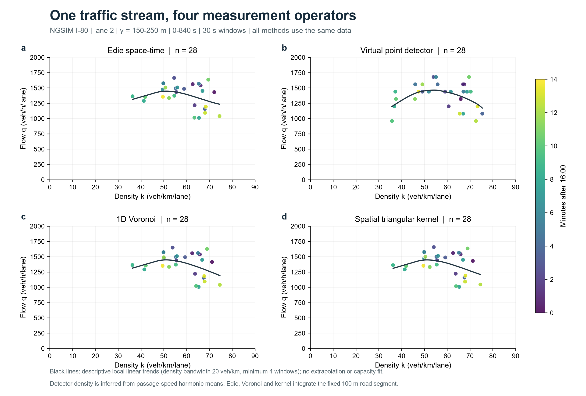
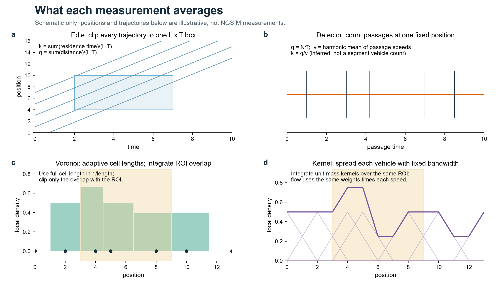
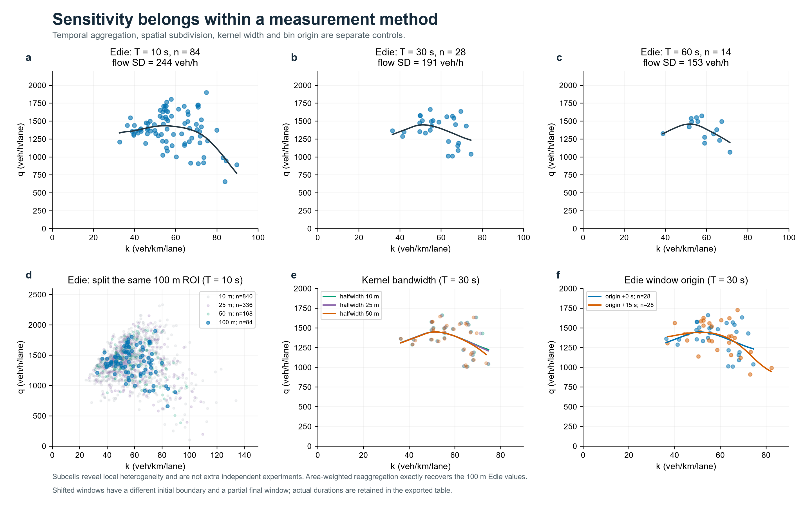
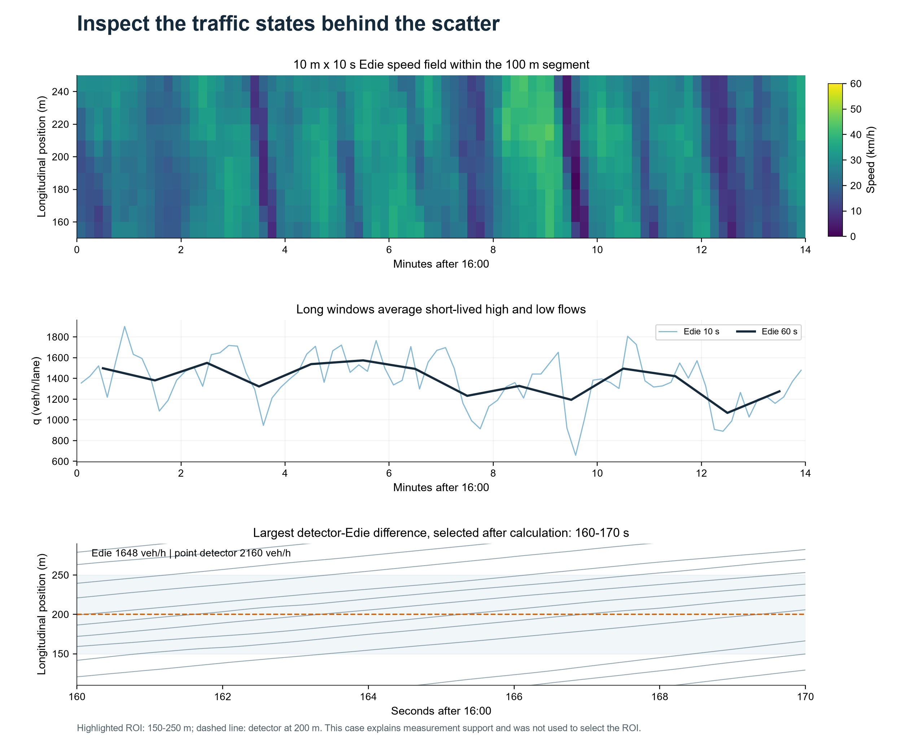
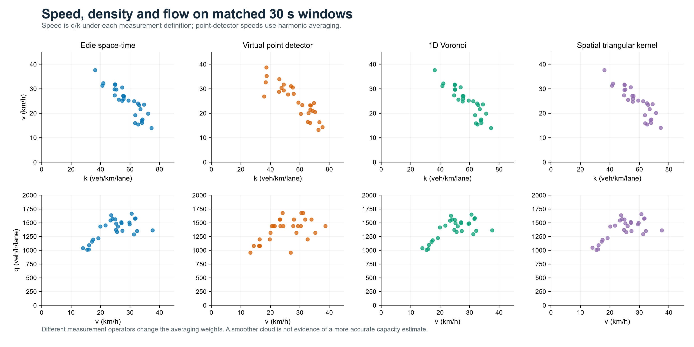
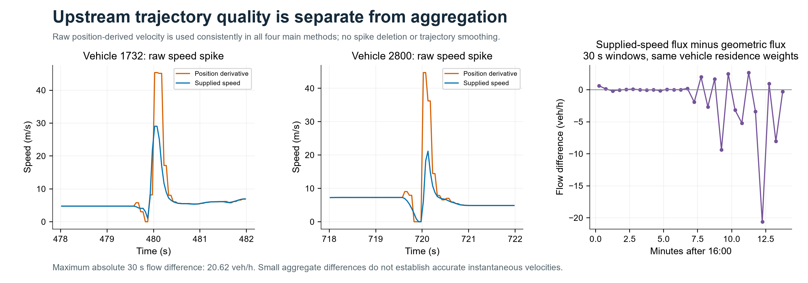

# 第 4 周 · 怎样用轨迹较好地表征交通流？

**NGSIM I-80｜四种测量方法｜时间与空间尺度敏感性**

[一页结果 PDF](results/one_page.pdf) · [高清预览](results/one_page.png) · [全部基本图数值](results/fundamental_points.csv) · [计算代码](model/measures.py) · [数据核查](results/audit.json)

本次用 **Edie 时空积分、虚拟断面、一维 Voronoi、空间三角核** 四种方法计算流量、密度与速度。10/30/60 秒时间窗属于各方法内部的敏感性分析，空间分段也作为 Edie 的尺度试验，不重复计作新方法。

## 结果先看



固定第 2 车道、150–250 m 路段和前 840 s；主图每点对应 30 s，各方法均为 **28 个有效窗口**。颜色表示时间，黑线是同一规则的局部线性趋势。单车道平均状态如下：

| 方法 | 密度 k（veh/km） | 流量 q（veh/h） | 速度 q̄/k̄（km/h） | 与 Edie 逐窗流量的平均绝对差（veh/h） |
|---|---:|---:|---:|---:|
| Edie 时空积分 | 58.19 | 1383.2 | 23.77 | — |
| 虚拟断面 | 57.57 | 1375.7 | 23.90 | 50.41 |
| 一维 Voronoi | 58.12 | 1380.8 | 23.76 | 5.52 |
| 空间三角核，半宽 25 m | 58.14 | 1382.8 | 23.78 | 3.16 |

统计原值见 [summary.csv](results/summary.csv)。平均速度由全时段的平均流量除以平均密度得到；**这里的差值是测量口径差异，不是相对于独立真值的误差**。

**结论：** 四种方法的总体平均状态接近，但短时间窗的点云明显不同。Edie 的时间窗从 10 s 增至 60 s，流量标准差由 244 降至 153 veh/h，下降 **37.4%**，平均流量仍为 1383.2 veh/h。更集中的点云说明聚合改变了分辨率，不能据此认定拟合更真实。本例适合以 100 m × 30 s 的 Edie 作为路段统计参照，同时展示短窗、局部速度场及其他测量定义；不能仅凭这 14 分钟数据识别完整基本图、容量或堵塞密度。

## 数据与统一口径

- **源文件：** 课程 ZIP 中的 `NGSIM_I80_20050413_1600-1615_SI.csv`；2005-04-13 16:00–16:15，I-80 东向，0.1 s 采样。米、秒已转换好，不再换算英尺。[官方数据入口](https://data.transportation.gov/d/8ect-6jqj) · [FHWA 数据说明](https://www.fhwa.dot.gov/publications/research/operations/06137/)。
- **分析范围：** 第 2 车道，纵向 `local_y_m ∈ [150,250)` m，长度 100 m；保留该车道全部车型，不做小汽车当量换算。`local_y_m` 是车辆前端中心的纵向位置，并非车身几何中心。[字段定义](https://ops.fhwa.dot.gov/publications/fhwahop08054/sect7.htm)。
- **共同时间：** `[0,840)` s，即 16:00–16:14。末段 883.6–899.9 s 缺少构造完整 Voronoi 胞元所需的外侧邻车；为四种方法和三种完整时间窗统一支持域，取前 840 s。共排除末尾 59.9 s，输入仍保留完整记录。截取依据是覆盖与窗口完整性，未按拟合效果挑选。
- **数据检查：** 全源 1,226,650 行、2,052 辆车，11 列无缺失，车辆—帧键无重复。本仓库随附 [SI 支持数据](data/lane2_support.csv.gz)：曾进入第 2 车道的 440 辆车、282,136 行，保留其全部时段和车道标签，便于处理换道和外部邻车；主分析路段涉及 339 辆车。
- **速度与换道：** 在相邻 0.1 s 位置之间作线性插值，纵向速度取位置差分；四种方法一致采用此定义。换道时刻假定为两帧中点，缺帧不跨越插值。输入速度列只用于核查，不与几何速度混用。
- **异常与来源核验：** 主范围内有 3 个原始间隔的位置差分速度超过 40 m/s，涉及车辆 1732、2800，已保留并展示。教师元数据的起始 `global_time_ms` 与 CSV 不符，采用实际 CSV 时间和 `time_s`。完整来源、筛选规则和 SHA-256 见 [manifest.json](data/manifest.json)，原教师说明保留在 [teacher_source.json](data/teacher_source.json)。

## 四种方法怎么算

以下公式先用 m、s 计算；导出时密度乘 1000，流量乘 3600，速度乘 3.6，分别得到 veh/km、veh/h、km/h。统一路段为 $R=[a,b)$，$L=b-a$，窗口为 $[t_0,t_0+T)$。所有速度都由相应口径的 $q/k$ 得到。



### 1. Edie：统计时空框内的车辆停留与行程

$$
k_E=\frac{\sum_i t_i}{LT},\qquad
q_E=\frac{\sum_i d_i}{LT},\qquad v_E=\frac{q_E}{k_E}.
$$

只累计每条轨迹**落在时空框内**的时间与纵向距离。车辆入界、出界和窗口边界按线性轨迹精确裁剪；停车贡献密度，行程贡献为零。这个定义与课堂给出的公式一致，适合表示固定路段的总体状态，也能按时空面积重新汇总子区域。

### 2. 虚拟断面：车辆经过固定位置时计数

在路段中点 $x=200$ m 设置断面。设窗口内过车数为 $N$，过线速度为 $u_j$：

$$
q_D=\frac{N}{T},\qquad
v_D=\frac{N}{\sum_j 1/u_j},\qquad
k_D=\frac{q_D}{v_D}=\frac{\sum_j1/u_j}{T}.
$$

采用过线速度的调和平均，而非算术平均。[FHWA 对空间平均速度的说明](https://ops.fhwa.dot.gov/publications/fhwahop08038/04infoshare.htm)。它直接测量断面通过量，密度则由流量和速度推算；**能否代表整个 100 m 路段，依赖状态的空间代表性**。短窗有整数计数效应，10 s 时每一辆对应 360 veh/h；无车通过时记录流量为零、密度与速度缺失，不能误判为路段空无车辆。

### 3. 一维 Voronoi：按车辆间距分配空间

按同车道纵向位置排序，车辆 $i$ 的胞元为相邻位置中点之间的区间 $V_i$。全胞元长度为 $\ell_i=(x_{i+1}-x_{i-1})/2$，与路段重叠长度为 $a_i=|V_i\cap R|$：

$$
k_V=\frac{1}{LT}\int_{t_0}^{t_0+T}\sum_i\frac{a_i(t)}{\ell_i(t)}\,dt,\qquad
q_V=\frac{1}{LT}\int_{t_0}^{t_0+T}\sum_i\frac{a_i(t)u_i(t)}{\ell_i(t)}\,dt.
$$

分母使用**完整胞元长度**，只裁剪分子的重叠长度。计算包含路段外邻车，要求胞元完整覆盖路段，不补造边界车辆。一维形式依据 [Steffen 与 Seyfried 的密度测量定义](https://arxiv.org/abs/0911.2165)，并沿用本工作台 `voronoi_density.py` 的“完整胞元密度 × ROI 重叠”逻辑。本次使用点车辆的一维线密度，不直接套用二维面积密度或车身占地模型。

优点是车辆过边界时贡献渐变；代价是依赖邻车覆盖，并引入测量区外信息。这里的流量使用相同胞元权重乘个体速度，是本次适配的通量定义；没有把空间平均速度和平均密度另行相乘。

### 4. 空间三角核：把车辆贡献分布到固定邻域

为每辆车分配单位积分的三角核，半宽为 $h$：

$$
W_h(z)=\frac{\max(0,1-|z|/h)}{h},\quad
m_i(t)=\int_a^bW_h(x-x_i(t))\,dx,
$$

$$
k_H=\frac{1}{LT}\int_{t_0}^{t_0+T}\sum_i m_i(t)\,dt,\qquad
q_H=\frac{1}{LT}\int_{t_0}^{t_0+T}\sum_i m_i(t)u_i(t)\,dt.
$$

主结果取 $h=25$ m，另比较 10、50 m。采用紧支撑三角核，空间积分使用解析分段二次 CDF；包含可能影响 ROI 的外侧车辆。核宽控制固定的平滑尺度，Voronoi 则按间距自适应。单位质量分布的测量思路见 [Steffen 与 Seyfried，第 2.1 节](https://arxiv.org/html/0911.2165v1)，本仓库独立实现一维三角核与配套通量。

Voronoi 和核方法的时间积分采用 0.05 s 中点求积；改为 0.025 s 后，30 s 窗口流量的最大差分别为 **0.0042、0.0021 veh/h**。核平滑改变的是测量定义，原始轨迹本身没有被平滑。

## 窗口与空间尺度的敏感性



| Edie 时间窗 | 共同有效窗口数 | 流量标准差（veh/h） | 最大窗口流量（veh/h） |
|---|---:|---:|---:|
| 10 s | 84 | 243.96 | 1900.68 |
| 30 s | 28 | 191.17 | 1664.91 |
| 60 s | 14 | 152.84 | 1573.77 |

这些最大值是本样本的窗口流量，**不是道路容量**。时间聚合会混合不同状态，同时减少点数；不能把 60 s 点云更紧理解为交通流本身波动变小。

- **空间分段：** 同一 100 m 路段分成 10/25/50/100 m 子段，固定 10 s 窗口，分别产生 840/336/168/84 个“子段—窗口”点，流量标准差为 313.4/296.9/277.9/244.0 veh/h。小子段能显露空间异质性，也更受离散车辆与局部事件影响。按面积重新汇总时，累计停留时间和距离恢复父路段结果，最大残差约 $1.14\times10^{-13}$。
- **核宽：** 半宽 10/25/50 m 的平均流量为 1383.1/1382.8/1382.2 veh/h，总体均值变化小，局部点和趋势仍有差别。这只能说明当前路段对此范围的核宽不太敏感，不能推出所有交通状态都如此。
- **窗口起点：** 比较从 0 和 $T/2$ 开始分箱。移位结果会少含开头 $T/2$ 秒，尾窗按实际长度计算，CSV 中保留起止时间和时长；该图同时体现边界取样影响，不能当作严格同域的独立重复试验。
- **拟合：** 所有 q–k 趋势统一使用局部线性回归，密度带宽 20 veh/km、至少 4 个窗口，只画观测密度范围，不外推、不预设抛物线。点云与时间颜色始终保留，没有按最高拟合优度筛选方法。

## 回到轨迹解释差异



10 m × 10 s 速度场显示路段内状态随位置和时间变化。在 160–170 s，断面通过 **6 辆**，得到 2160 veh/h；100 m 路段的 Edie 流量为 **1647.8 veh/h**。前者取决于过线事件，后者累计框内车辆的距离，因而非均匀交通状态下不必相等。这个例子按“10 s 窗口中两者流量绝对差最大”事后选取，只用于解释，不参与范围选择或参数优化。

<details>
<summary>展开：速度—密度、流量—速度及原始速度核查</summary>





车辆 1732、2800 的短时位置差分存在尖峰。若只将同一停留权重下的几何速度替换为源速度列，30 s 通量最大差为 20.62 veh/h。聚合差异较小不代表瞬时速度准确，也不能把轨迹噪声全部归因于基本图绘制方法。

</details>

## 绘制心得：怎样更好地表征这股交通流

1. **先确定要表征的对象。** 路段状态采用 Edie 可保证时空累计量一致；断面监测则保留过线流量。两者用途不同，应说明密度是直接统计还是推算，不能只按曲线是否好看排序。
2. **固定比较口径，再选择分辨率。** 同车道、同单位、同有效时段、同速度定义、同坐标范围是前提。本例把 30 s 作为展示折中，配 10 s 细节和 60 s 汇总；尚无证据证明 30 s 是普遍最优窗口。
3. **用局部状态检查平均是否掩盖现象。** 10 m 子段和时空速度图能帮助识别速度变化；若目标是研究停车波或换道，应保留更细分辨率。若目标是长期通过量，则可用更长窗口，并明确波动已被平均。
4. **平滑尺度、边界与异常必须可追溯。** Voronoi 需要外部邻车，核方法需要核宽；不能仅取 ROI 内车辆再硬截胞元。原始轨迹异常单独检查，避免同时换测量法、速度源和清洗规则而无法解释差别。
5. **拟合只是对已有状态的描述。** 先给散点、样本数和覆盖范围，再给趋势。相邻窗口、相邻子段共享交通过程，不是独立实验；本次未做独立性假设下的显著性检验。若要估计容量或不确定性，应补充更多时段与交通状态，并采用时间块等相关性处理。

## 复现与文件

在**仓库根目录**执行，建议 Python 3.12：

```bash
python -m pip install -r week04/requirements.txt
python -X utf8 -m week04.model.run
```

随附的压缩 SI 子集足以离线复算，不依赖个人磁盘或另行下载。一次运行生成全部 CSV、6 张分析/示意 PNG 和一页 PDF；本机约 7 秒。保留已提交结果的复算方式：

```bash
python -X utf8 -m week04.model.run --output .local/week04_reproduce
python -m pip install pytest==9.1.1
python -m pytest -q tests/test_week04_measures.py tests/test_week04_results.py
```

从教师原 ZIP 重新生成并核验输入：

```bash
python -X utf8 -m week04.model.prepare "第4周_NGSIM-I80_课堂数据.zip" --output .local/week04_input.csv.gz
```

`prepare` 核验源 CSV 与生成子集的 SHA-256，分离输出避免覆盖提交输入。PDF 默认嵌入 Windows 宋体；其他系统可通过环境变量 `TRAJ_CJK_FONT` 指向可嵌入的中文 TTF/TTC 字体。无字体时使用 PDF 中文 CID 字体，阅读器需有对应字体支持。仓库附带的 PDF 已嵌入中文字体；预览 PNG 从该 PDF 渲染，并非另一份报告。

```text
week04/
├── README.md、config.json、requirements.txt
├── data/       压缩输入、来源与校验值
├── model/      数据准备、四种计算、分析、制图、PDF、运行入口
└── results/    一页报告、图件、逐窗口数值和审计记录
```

输入与配置校验、运行环境及输出哈希见 [reproducibility.json](results/reproducibility.json)。测试覆盖均匀交通流解析解、停车、入出边界、换道、缺帧、胞元边界、核质量、计数归属和时空可加性；另外检查提交结果的共同支持域和流速密一致性。GitHub 自动复跑本周计算。

**来源与 AI 辅助：** Edie 公式遵照课堂图片；断面速度依据 FHWA；Voronoi 与核测量思路的文献链接见上文。复用第 1 周 `style.py` 与既有工作台的胞元裁剪思想，源脚本哈希记录在 manifest；本周计算代码独立实现。Codex 辅助检索、实现、测试、绘图和撰写；所有结果来自所附实际数据计算，示意图明确标注为示意。NGSIM 数据来源及权利说明保留，未另行给原始数据赋予代码许可证。
